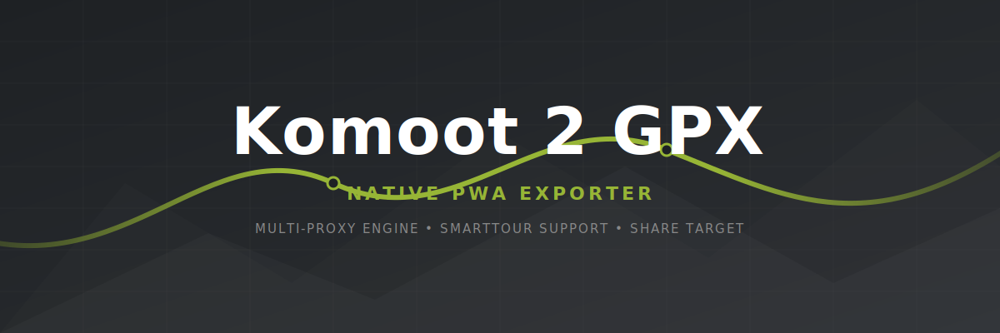

  

# Komoot-2-GPX Exporter 🚴‍♂️⛰️

A lightweight, purely client-side Progressive Web App (PWA) to quickly download public Komoot tours as GPX files without needing a premium subscription. Fully optimized for smartphones and seamless import into ecosystems like Garmin Connect.

👉 **[Launch Web App](https://basecore.github.io/Komoot-2-GPX/)**

## ✨ Features (v2.7 Pro)

* **🚀 Native Android "Share" Integration:** Through the Web Share Target API, this app seamlessly integrates into your smartphone's OS. Hit "Share -> Other Apps" inside the official Komoot app, select "Komoot 2 GPX", and the PWA will instantly launch, grab the link, and auto-start the GPX download. No copy-pasting required!
* **🎨 Pro UI & Glassmorphism:** A beautiful, responsive card-based interface with smooth animations, custom SVG icons, and a developer-grade terminal window.
* **🔄 Smarttour & Discovery Support:** Automatically detects whether you pasted a regular user tour (`/tour/`) or a generated Komoot collection (`/smarttour/`) and routes API calls accordingly.
* **🛡️ 8-Layer Proxy Fallback Engine:** Since Komoot strictly blocks public CORS proxies, this app features a robust, automated rotation of 8 independent proxy servers (including direct API fallback and 10-second timeout killswitches). If one proxy is blocked, it instantly switches to the next one—ensuring maximum uptime.
* **🗺️ Interactive Leaflet Map:** Displays the exact route on an OpenStreetMap interface before the download begins, allowing you to visually verify the tour.
* **⌚ Garmin-Ready Data:** Generates 100% compliant XML/GPX files containing both elevation (`<ele>`) and precise timestamps (`<time>`), which are mandatory for activity tracking in Garmin Connect.
* **📱 100% PWA Installable:** Meets Chrome's strict install criteria (including maskable icons). Install it directly on your home screen (Android/iOS) via the built-in "Install App" button to use it like a native app in full-screen mode.

## 📱 How to Use (Smartphone & Desktop)

### Option A: The "Pro" Workflow (Android / iodéOS / LineageOS)
1. Open the [Komoot-2-GPX App](https://basecore.github.io/Komoot-2-GPX/) in Chrome, Brave, or Kiwi Browser.
2. Click the blue **"📱 Install App on Device"** button (or use the browser menu to "Add to Home Screen").
3. Open your official Komoot app and find a public tour.
4. Tap "Share" -> "More Apps..." and select **Komoot 2 GPX**.
5. The app opens, auto-pastes the link, and triggers the GPX download instantly.

### Option B: The Manual Workflow (Any Device)
1. Open the Komoot App or Website.
2. Navigate to a **public** tour or smarttour collection.
3. Use the "Share" function to copy the tour link to your clipboard (e.g., `https://www.komoot.de/tour/123456789`).
4. Open the **[Komoot-2-GPX App](https://basecore.github.io/Komoot-2-GPX/)**.
5. Paste the link and click "Preview & Download GPX".

## 🛠 Technical Details

This project is built using vanilla HTML, CSS, and JavaScript. 
To bypass strict CORS (Cross-Origin Resource Sharing) policies and access the open Komoot `v007` API directly from the browser, the app utilizes an automated, fail-safe proxy routing mechanism. The downloaded JSON coordinates are then assembled into a valid GPX document and triggered as a local file download directly on your device. 
**Privacy First:** Zero data is sent to custom backends. The entire parsing process happens locally in your browser.

## 🤖 Credits

The architecture, UI design, code logic, and proxy fallback mechanism were entirely developed with the help of **Gemini 3.1 Pro**.

---
**Disclaimer:** This project is not affiliated with or endorsed by Komoot in any way. It strictly uses publicly accessible API endpoints. Designed for personal and private use only.
