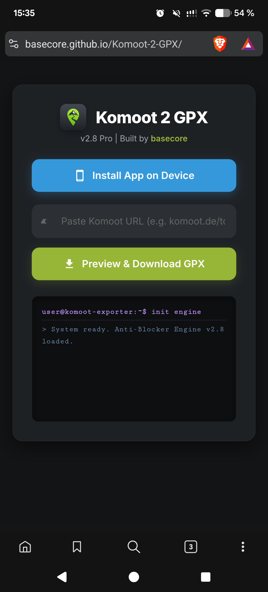
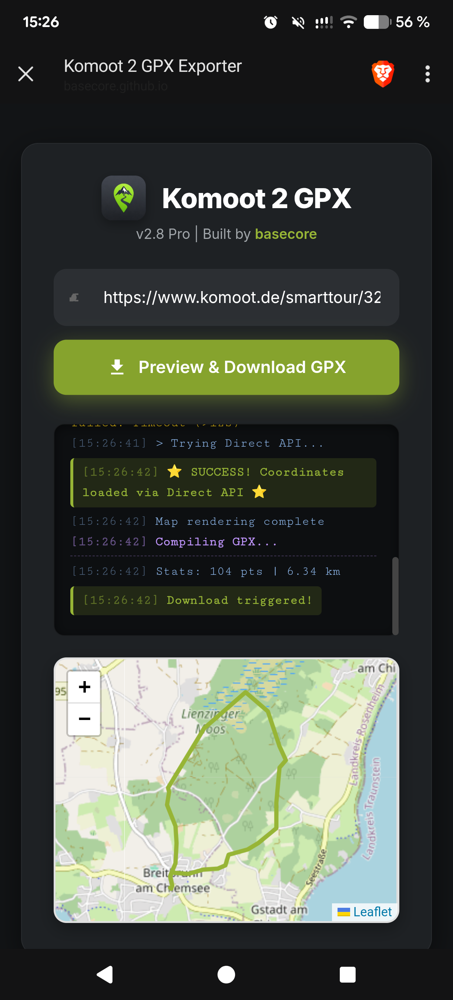

  

# Komoot-2-GPX Exporter 🚴‍♂️⛰️

A lightweight, purely client-side Progressive Web App (PWA) to quickly download public Komoot tours as GPX files without needing a premium subscription. Fully optimized for smartphones and seamless import into ecosystems like Garmin Connect.

👉 **[Launch Web App](https://basecore.github.io/Komoot-2-GPX/)**

  
  &nbsp;&nbsp;&nbsp;
  

## ✨ Features (v3.1 Pro)

* **🚀 Native Android "Share" Integration:** Through the Web Share Target API, this app seamlessly integrates into your smartphone's OS. Hit "Share -> Other Apps" inside the official Komoot app, select "Komoot 2 GPX", and the PWA will instantly launch, grab the link, and auto-start the GPX download in the background. No copy-pasting required!
* **📂 "Open in App" Routing:** Once the GPX file is downloaded, a dynamic button appears that leverages the native device Share API. This allows you to instantly push the downloaded file into your favorite offline navigation app (e.g., OsmAnd, Garmin Connect, Locus Map).
* **🔒 Private Tour Detection:** Intelligently detects if a shared tour is restricted or private and provides clear, descriptive feedback in the console instead of generic API errors.
* **🛡️ Anti-Adblocker Engine ("Wrapped" Mode):** Bypasses aggressive network adblockers (like the ones built into iodéOS) using a specialized data wrapper to securely fetch coordinates without getting blocked.
* **🔧 HTTP 406 Bypass:** Injects custom `application/hal+json` headers to prevent Komoot's direct API from rejecting the fetch requests.
* **🎨 Pro UI & Live Debug Console:** A beautiful, responsive card-based interface with smooth animations, custom SVG icons, and a developer-grade terminal window that shows you exactly what the app is currently doing and where files are saved.
* **🔄 Smarttour & Discovery Support:** Automatically detects whether you pasted a regular user tour (`/tour/`) or a generated Komoot collection (`/smarttour/`) and routes API calls accordingly.
* **🌐 8-Layer Proxy Fallback Engine:** Since Komoot strictly blocks public CORS proxies, this app features a robust, automated rotation of 8 independent proxy servers. If one proxy fails, it instantly switches to the next one—ensuring maximum uptime.
* **🗺️ Interactive Leaflet Map:** Displays the exact route on an OpenStreetMap interface before the download begins, allowing you to visually verify the tour.
* **⌚ Garmin-Ready Data:** Generates 100% compliant XML/GPX files containing both elevation (`<ele>`) and precise timestamps (`<time>`), which are mandatory for activity tracking in Garmin Connect.
* **📱 100% PWA Installable:** Meets Chrome's strict install criteria (including maskable icons). Install it directly on your home screen via the built-in "Install App" button to use it like a native app in full-screen mode.

## 📱 How to Use (Smartphone & Desktop)

### Option A: The "Pro" Workflow (Standard Android)
1. Open the [Komoot-2-GPX App](https://basecore.github.io/Komoot-2-GPX/) in Chrome, Brave, or Kiwi Browser.
2. Click the blue **"📱 Install App on Device"** button (or use the browser menu to "Add to Home Screen").
3. Open your official Komoot app and find a public tour.
4. Tap "Share" -> "More Apps..." and select **Komoot 2 GPX**.
5. The app opens, auto-pastes the link, and triggers the GPX download instantly.

### Option B: The Manual Workflow (Any Device)
1. Open the Komoot App or Website.
2. Navigate to a **public** tour or smarttour collection.
3. Use the "Share" function to copy the tour link to your clipboard (e.g., `https://www.komoot.de/tour/123456789`).
4. Open the **[Komoot-2-GPX App](https://basecore.github.io/Komoot-2-GPX/)**.
5. Paste the link and click "Preview & Download GPX".

---

## ⚠️ Known Limitations: Android "Share" Menu (iodéOS / De-googled Phones)

Standard Chromium browsers require **Google Play Services** to silently convert a PWA into a native "WebAPK". Only these true WebAPKs are allowed to appear in the Android Share Menu. 
On **de-googled operating systems (like iodéOS, CalyxOS, GrapheneOS)** or when using Firefox, the browser will only create a "homescreen bookmark", which Android strictly prevents from acting as a Share Target.

### 🛠️ Workarounds for De-googled Users (To unlock the Share Menu):
If you want the full "Share -> Komoot 2 GPX" functionality on a privacy-focused phone, you need to wrap the PWA into a real `.apk`:

1. **PWABuilder (Recommended):** 
   Go to [PWABuilder.com](https://www.pwabuilder.com/), enter the URL of this repository, and click "Package for Android". Download the generated `.apk` and install it. As a native app, it will reliably show up in your Share Menu!
2. **Native Alpha / Web Apps (F-Droid):** 
   Use an open-source sandbox wrapper like [Native Alpha](https://github.com/cylonid/NativeAlphaForAndroid) from F-Droid to containerize the website into an isolated Android app, which handles share intents natively.

---

## 🛠 Technical Details

This project is built using vanilla HTML, CSS, and JavaScript. 
To bypass strict CORS (Cross-Origin Resource Sharing) policies and access the open Komoot `v007` API directly from the browser, the app utilizes an automated, fail-safe proxy routing mechanism. The downloaded JSON coordinates are then assembled into a valid GPX document and triggered as a local file download directly on your device. 
**Privacy First:** Zero data is sent to custom backends. The entire parsing process happens locally in your browser.

## 🤖 Credits

* **Developer:** [basecore](https://github.com/basecore)
* **AI Assistance:** The architecture, UI design, code logic, and the advanced 8-layer proxy fallback mechanism were entirely developed and optimized with the help of **Gemini 3.1**.

---
**Disclaimer:** This project is not affiliated with or endorsed by Komoot in any way. It strictly uses publicly accessible API endpoints. Designed for personal and private use only.
